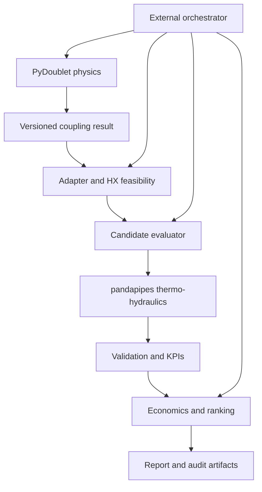

> **Status note (added 2026-09-04, historical baseline — body unedited below):** this is the
> original six-week scoping plan for the connection-only PoC (D1: one fixed PyDoublet result,
> candidate network-connection points only). It is preserved here unedited as the historical
> record. The project has since implemented a synthetic joint site/connection-optimization
> extension (`workflow/joint_optimization.py`) that additionally varies a synthetic geothermal
> scenario/site axis, independent of the network-connection axis — see
> `docs/decisions/ADR-001-geothermal-poc-scope.md` (amendment D9) and
> `docs/issues/joint-location-optimization.md` for the current, authoritative scope. That
> extension is itself now being corrected under
> `docs/specifications/R3CHAIN_CORRECTED_JOINT_SITE_CONNECTION_IMPLEMENTATION_SPEC.md`
> (ADR-001 amendment D10, 2026-09-04) — consult it, not this document, for the joint
> layer's current target and status.

# R3-CHAIN PyDoublet–pandapipes Proof-of-Concept Implementation Plan

**Prepared for:** Ishantha Hewaratne  
**Project:** R3-CHAIN geothermal integration workstream  
**Date:** 18 August 2026  
**Primary milestone:** A reproducible, auditable, MCP-based proof of concept  
**Time box:** Six weeks, with a workshop-ready vertical slice by the Wuppertal kickoff on 15 September 2026

## 1. Executive decision

Build a small, scientifically defensible vertical slice that answers one question:

> Given one defined geothermal doublet result, at which candidate supply/return connection pair should the resulting surface heat source connect to a small district-heating network?

The proof of concept must actually run PyDoublet, convert its output through a typed and validated adapter, evaluate several candidate connection points in a fixed four-consumer pandapipes network, calculate technical and indicative economic KPIs, reject infeasible candidates with explicit reason codes, rank only feasible candidates, and expose the operations through MCP-compatible tools with an audit trail.

The proof of concept must **not** claim to determine where the doublet should be drilled. Geological drilling-site optimisation is a later phase that requires multiple spatial PyDoublet scenarios and geological data.

## 2. Definition of done

The first proof of concept is complete only when all of the following are true:

1. A clean Python 3.11 environment can install and run the selected PyDoublet example.
2. PyDoublet returns a stable, versioned coupling result rather than requiring downstream code to search timestamped files or interpret undocumented array positions.
3. A deterministic adapter validates units and physics and calculates the heat actually deliverable through a surface heat exchanger.
4. A fixed synthetic district-heating network contains a supply network, mirrored return network and four consumers.
5. A baseline case and at least three candidate supply/return connection pairs run independently on copied networks.
6. Full sequential thermo-hydraulic pipeflow convergence is required for a candidate to be feasible.
7. Hard technical gates check temperature compatibility, geothermal capacity, delivered heat, pressure, velocity, mass balance and energy balance.
8. Indicative economics include the declared cost boundary and all assumptions and sources.
9. Only technically feasible candidates enter the economic ranking.
10. The deterministic workflow is callable through MCP tools and one external orchestrator.
11. One command produces raw results, converted results, candidate results, ranking, figures and an audit manifest.
12. Unit, integration, contract and end-to-end tests pass without network access or real Wuppertal data.

## 3. Scope boundary

### Included in the six-week proof of concept

- One deterministic PyDoublet operating point.
- One synthetic network with approximately four consumers.
- Explicit supply and return networks.
- Three to five predefined candidate connection pairs.
- Surface heat-exchanger coupling logic.
- Optional auxiliary heat accounting as a policy, not heat-pump optimisation.
- Technical and indicative economic KPIs.
- Hard feasibility gates followed by transparent ranking.
- MCP-compatible tools and an external orchestrator.
- Machine-readable outputs, visualisation and human-readable explanation.
- Reproducible configuration, tests, provenance and audit log.

### Deliberately deferred

- Real Wuppertal network or geological data.
- Determination of the geothermal drilling location.
- A 50 m/100 m geological grid or hexagonal spatial optimisation.
- Annual or transient PyDoublet output.
- Fully dynamic hydraulic simulation.
- Steam-network conversion.
- Advanced mathematical optimisation or machine learning.
- Detailed heat-exchanger design.
- Heat-pump design and optimisation.
- A new native geothermal component inside core pandapipes.
- A production Agent Fred or production conversational interface.
- A fully validated commercial cost database.

## 4. Target architecture



The layers must remain separate:

- **PyDoublet is authoritative for the subsurface/doublet calculation.**
- **The adapter is authoritative for the coupling boundary and surface heat-exchanger assumptions.**
- **pandapipes is authoritative for district-heating thermo-hydraulics.**
- **Deterministic code is authoritative for feasibility, KPIs and ranking.**
- **The LLM/orchestrator may select tools and explain structured results; it must not invent, override or recalculate physical results.**

## 5. Repository strategy

Do not modify Tanja's main pandapipesAI branch directly.

Use three controlled work areas:

1. **PyDoublet integration branch**
   - Fix packaging and importability without changing the physics.
   - Add a stable programmatic result contract.
   - If Dr. Jan's separate PyDoublet-MCP repository is available, use and extend that contract instead of creating a duplicate server.

2. **R3-CHAIN branch/fork of pandapipesAI**
   - Suggested branch: `feature/r3chain-geothermal-poc`.
   - Add a `special_modules/geothermal/` package using the existing `geo_` naming convention.
   - Reuse core sessions, response-contract conventions, visualisation and costing patterns.

3. **Demo configuration and orchestration**
   - Keep a deterministic runner, MCP client, example configuration and expected outputs under `examples/r3chain_geothermal_demo/` or a small R3-CHAIN demo repository.
   - Pin the exact PyDoublet and pandapipesAI commit hashes used by the demonstration.

Recommended pandapipesAI structure:

```text
pandapipesai/
  special_modules/
    geothermal/
      __init__.py
      schema.py
      pydoublet_adapter.py
      coupling.py
      synthetic_network.py
      evaluator.py
      economics.py
      ranking.py
      reporting.py
      tools.py
tests/
  geothermal/
    fixtures/
      pydoublet_sample.json
      demo_config.json
    test_schema.py
    test_pydoublet_adapter.py
    test_coupling.py
    test_synthetic_network.py
    test_evaluator.py
    test_economics.py
    test_ranking.py
    test_geo_tools.py
    test_geo_end_to_end.py
examples/
  r3chain_geothermal_demo/
    config.json
    run_demo.py
    run_mcp_demo.py
    README.md
```

## 6. Phase 0: decisions and evidence before coding

Create `docs/decisions/ADR-001-geothermal-poc-scope.md` and record the agreed boundary. Ask Tanja and Dr. Jan only the questions that materially change implementation:

1. Is the separate PyDoublet-MCP repository available, and is it the interface the demonstration must use?
2. Which explicit PyDoublet variable is the producer wellhead/surface temperature? Do not permanently rely on index 2 of `temperature_profile_c` without confirmation.
3. Is `exit_temp_heat_exchanger` a fixed modelling input, a required reinjection limit or a calculated result?
4. Which district-heating supply/return temperatures should the demonstration use?
5. What minimum heat-exchanger approach temperature should be assumed?
6. Should insufficient geothermal heat make a candidate infeasible, or should an auxiliary source cover the shortfall and be costed?
7. Which source should be used for doublet, heat-exchanger and O&M costs?
8. Should ranking be technical feasibility followed by lowest annualised cost? This is the recommended rule.
9. Is the six-week result expected to use the existing PyDoublet-MCP as one server and pandapipesAI as another, with an external client connecting both?
10. Where will the R3-CHAIN branch be hosted and which licence governs the PyDoublet code? The current repository contains conflicting Apache-2.0 and MIT declarations.

Coding need not stop while answers are pending. Put provisional values in configuration, label them `demo_assumption`, and make them replaceable without code changes.

## 7. Phase 1: establish reproducible baselines

### 7.1 Environment

Use Python 3.11 because pandapipesAI requires it and its verified environment uses Python 3.11. Keep PyDoublet and pandapipesAI in separate environments for the final MCP demonstration; they may share a development environment only if dependency resolution is clean.

For pandapipesAI:

```bash
python3.11 -m venv .venv
source .venv/bin/activate
python -m pip install --upgrade pip
python -m pip install -e ".[dev,viz,costing]"
python -m pytest -q
```

For PyDoublet, after the minimal package repair:

```bash
python3.11 -m venv .venv
source .venv/bin/activate
python -m pip install --upgrade pip
python -m pip install -e ".[dev]"
python -m pytest -q
python -m pydoublet.main --config examples/no_figures_config.json --no-figures
```

Do not use the exported pandapipesAI `environment.yml` unchanged on Linux or macOS because it contains Windows-specific packages. Use the project metadata or create a platform-specific lock file.

### 7.2 Golden PyDoublet result

The supplied example currently produces approximately:

- Brine mass flow: 28.749 kg/s.
- Producer/surface temperature candidate: 76.313 °C, pending field confirmation.
- Configured heat-exchanger exit temperature: 35.0 °C.
- Geothermal power: 4,345.417 kW.
- Doublet pump electricity: 177.450 kW.
- COP: 24.488.
- Brine heat capacity: 3,658.620 J/(kg·K).

Store this as a golden test fixture with tolerances. It is a regression reference, not a universal project design point.

### 7.3 Minimum PyDoublet repair

Make only integration-enabling changes:

- Replace top-level internal imports with package-relative imports.
- Use package discovery so all subpackages are installed.
- Declare `pydantic` explicitly.
- Make `Scenario.calculate()` return a result dictionary or typed object while preserving optional JSON export.
- Allow the caller to set an explicit output path or disable file output.
- Correct deterministic metadata so one deterministic run is not reported as 1,000 completed runs.
- Add a stable producer-wellhead temperature field.
- Add packaging, import and result-contract tests.
- Resolve the licence inconsistency before code is copied or redistributed.

Do not change reservoir equations, well equations, convergence logic or physical defaults in this phase.

## 8. Phase 2: define the stable coupling contracts

### 8.1 PyDoublet coupling result

Create a versioned typed schema such as:

```json
{
  "schema_version": "1.0",
  "run_id": "uuid-or-content-hash",
  "converged": true,
  "brine_mass_flow_kg_s": 28.749278,
  "producer_wellhead_temperature_c": 76.313044,
  "reinjection_temperature_c": 35.0,
  "geothermal_thermal_power_kw": 4345.417312,
  "doublet_pump_power_kw": 177.449827,
  "cop": 24.488146,
  "brine_heat_capacity_j_kg_k": 3658.620334,
  "source_config_hash": "sha256:...",
  "source_model_version": "pydoublet-1.0+commit",
  "assumptions": {},
  "provenance": {}
}
```

Every numeric field has one canonical unit in its name. The adapter must reject ambiguous duplicate units.

### 8.2 Coupling assumptions

Store all assumptions in configuration:

```json
{
  "dh_supply_temperature_c": 70.0,
  "dh_return_temperature_c": 40.0,
  "minimum_hx_approach_k": 5.0,
  "hx_heat_delivery_factor": 0.98,
  "curtailment_allowed": true,
  "auxiliary_policy": "cost_shortfall",
  "velocity_limit_m_s": 1.5,
  "pump_dp_limit_bar": 6.0,
  "consumer_supply_drop_limit_k": 5.0,
  "mass_balance_tolerance_fraction": 0.005,
  "energy_balance_tolerance_fraction": 0.02
}
```

These are configurable demonstration defaults, not claimed universal engineering standards.

### 8.3 Candidate specification

Each candidate contains:

- Candidate ID and label.
- Supply junction name.
- Matching return junction name.
- Surface connection length.
- Connection-pipe DN/roughness/heat-loss assumptions.
- Optional coordinates for visualisation.
- Optional construction multiplier.

The production and injection wells are not represented as two distant district-heating nodes. They meet at one surface plant; the surface heat exchanger connects the DH supply and return sides locally.

### 8.4 Candidate result

Each result must include:

- `feasible` Boolean.
- `status` and exact failure codes.
- PyDoublet and coupling run IDs.
- Thermo-hydraulic convergence status.
- Technical KPIs.
- Economic KPIs.
- Warnings.
- Assumptions and provenance.
- Rank or `null` when infeasible.

Use stable failure codes such as:

- `PYDOUBLET_NOT_CONVERGED`.
- `MISSING_COUPLING_FIELD`.
- `UNIT_OR_SIGN_ERROR`.
- `HX_SUPPLY_TEMPERATURE_INFEASIBLE`.
- `HX_COLD_END_APPROACH_INFEASIBLE`.
- `GEOTHERMAL_CAPACITY_SHORTFALL`.
- `THERMAL_PIPEFLOW_NOT_CONVERGED`.
- `PRESSURE_LIMIT_EXCEEDED`.
- `VELOCITY_LIMIT_EXCEEDED`.
- `CONSUMER_TEMPERATURE_NOT_MET`.
- `MASS_BALANCE_FAILED`.
- `ENERGY_BALANCE_FAILED`.

## 9. Phase 3: implement the deterministic adapter

The adapter is the central scientific contribution. Implement it before MCP wrappers.

### 9.1 Input validation

- Require a converged PyDoublet result.
- Require every mandatory field and canonical unit.
- Reject NaN, infinite, negative power, non-positive mass flow and impossible temperatures.
- Retain the unmodified raw PyDoublet result and its hash.
- Record every conversion and assumption.

### 9.2 Energy-consistency check

Check the reported thermal power against:

\[
Q_{calc}=\dot m_{brine}\,c_{p,brine}\,(T_{prod}-T_{reinj})
\]

The relative difference must be below a configurable tolerance, initially 1–2%. A larger difference is a hard failure because it usually indicates a unit, field or sign error.

### 9.3 Heat-exchanger feasibility

For direct heat transfer:

\[
T_{prod} \ge T_{DH,supply}+\Delta T_{min}
\]

and the allowable hot-side outlet is at least:

\[
T_{geo,out,allowed}=\max(T_{reinj,min},T_{DH,return}+\Delta T_{min})
\]

Then calculate the direct heat deliverable:

\[
Q_{direct}=\min\left(Q_{PyDoublet},\dot m_{brine}c_p(T_{prod}-T_{geo,out,allowed})\right)\eta_{delivery}
\]

This is crucial for the current sample. Its reported 4.345 MW assumes cooling from approximately 76.31 °C to 35 °C. With a 40 °C DH return and a 5 K minimum approach, the geothermal outlet cannot remain at 35 °C for direct exchange; it must be at least 45 °C. The directly usable heat is therefore lower than the raw PyDoublet power. The adapter must expose both values instead of silently treating them as identical.

### 9.4 Separate brine and district-heating flows

Never insert the PyDoublet brine mass flow as the district-heating water flow.

The DH flow is determined independently:

\[
\dot m_{DH}=\frac{Q_{DH}}{c_{p,water}(T_{supply}-T_{return})}
\]

Report both flows with explicit names.

### 9.5 Capacity policy

Calculate:

- Geothermal heat used.
- Curtailed geothermal heat.
- Auxiliary/unmet heat.
- Geothermal coverage fraction.

Recommended version-one policy: geothermal supplies as much feasible heat as possible; a documented auxiliary source covers the remainder for KPI/economic accounting. Also include a strict test mode in which any shortfall is infeasible.

## 10. Phase 4: build the synthetic pandapipes network

### 10.1 Design

Build the network directly in code; do not use OSM for this demonstration.

Use:

- Four consumers.
- Full mirrored supply and return networks.
- Fixed topology and fixed pipe diameters across candidate evaluations.
- Named junction pairs so each candidate refers to one supply junction and its corresponding return junction.
- One pressure-controlled DH circulation pump representing the surface plant boundary.
- Heat consumers with fixed heat demand and design temperature difference.

A useful initial demand set is 650, 750, 850 and 950 kW, totalling 3.2 MW. It is close enough to the estimated directly usable heat from the sample to make the temperature/capacity constraints meaningful. Keep the values in configuration so they can be changed after review.

### 10.2 Candidate set

Define at least four candidates:

- Near the network head.
- Near the central trunk.
- Near a branch intersection.
- Near the remote/end section.

Give each a different surface connection length. The exact geometry need only be synthetic but must remain constant and visually understandable.

### 10.3 Baseline

Run an unlimited/reference heat-source case first using the same topology, demands and pipe sizes. Record:

- Sequential convergence.
- Total heat demand.
- Pressure range.
- Pump differential pressure.
- Total DH mass flow.
- Maximum pipe velocity.
- Consumer inlet and outlet temperatures.
- Network heat loss.

If the baseline fails, no candidate evaluation is valid.

### 10.4 Candidate mutation rule

For every candidate:

1. Deep-copy the baseline/template network.
2. Place/recreate the surface source boundary at the candidate supply/return pair.
3. Add the candidate-specific connection pipes and length.
4. Apply the deliverable geothermal capacity and auxiliary policy.
5. Run sequential thermo-hydraulic pipeflow.
6. Extract KPIs and apply gates.
7. Discard the mutated copy after serialising the result.

Do not use `tb_set_heat_source` for the controlled comparison because it rebuilds and redimensions the greenfield topology. That would change multiple variables at once. Do not rely on `tb_add_heat_source` for capacity enforcement because its mass-flow parameter is documentation only and the added pressure pump is effectively unlimited.

## 11. Phase 5: technical validation gates

Apply gates in this order:

1. PyDoublet convergence and schema.
2. Unit/sign and energy consistency.
3. Heat-exchanger hot-end temperature feasibility.
4. Heat-exchanger cold-end/pinch feasibility.
5. Geothermal capacity/auxiliary policy.
6. Full sequential pandapipes convergence.
7. Consumer heat and temperature delivery.
8. Pressure limits.
9. Pipe velocity limits.
10. Mass balance.
11. Energy balance.

Recommended configurable initial limits:

| Check | Demonstration default |
|---|---:|
| Maximum pipe velocity | 1.5 m/s |
| Maximum pump differential pressure | 6 bar |
| Minimum absolute network pressure | 1.0–1.5 bar, confirm |
| Maximum consumer supply-temperature drop | 5 K |
| Heat-delivery tolerance | 1% |
| Mass-balance relative error | 0.5% |
| Energy-balance relative error | 2% |
| PyDoublet energy-consistency error | 1–2% |

The existing pandapipesAI validator falls back to hydraulics when sequential thermal calculation fails. That fallback is useful diagnostically, but a geothermal candidate must not be declared feasible without valid thermal results. Preserve the hydraulic diagnostics, then fail the candidate with `THERMAL_PIPEFLOW_NOT_CONVERGED`.

## 12. Phase 6: KPIs and economic boundary

### 12.1 Technical KPIs

For every candidate report:

- Raw PyDoublet power.
- Directly deliverable geothermal heat.
- Geothermal heat used.
- Geothermal curtailment.
- Auxiliary or unmet heat.
- Geothermal coverage fraction.
- Brine flow and DH flow separately.
- Doublet pump electrical power.
- DH circulation-pump electrical power.
- Minimum/maximum pressure.
- Pump differential pressure.
- Maximum pipe velocity.
- Minimum consumer supply temperature.
- Mean return temperature.
- Heat delivered to consumers.
- Network heat loss.
- Mass- and energy-balance residuals.

### 12.2 Economic boundary

Use a transparent prototype boundary:

- Doublet CAPEX supplied as a documented assumption unless PyDoublet later exports it.
- Surface heat-exchanger CAPEX.
- Candidate connection-pipe CAPEX based on length and DN.
- Fixed O&M for doublet/HX/network.
- Doublet-pump electricity.
- DH-pump electricity.
- Auxiliary heat cost.
- Annual heat delivered.
- Annualised total cost and indicative LCOH.

Use the existing pandapipesAI cost-ledger and annuity patterns where applicable. Add geothermal-specific ledger keys under `geo.*`; never hide assumptions as numeric constants in calculation code.

Use:

\[
a=\frac{i(1+i)^n}{(1+i)^n-1}
\]

\[
C_{annual}=a\,CAPEX+OPEX_{fixed}+OPEX_{electricity}+C_{auxiliary}
\]

\[
LCOH_{indicative}=\frac{C_{annual}}{Q_{delivered,annual}}
\]

Because the same PyDoublet result is used for every candidate, doublet CAPEX is identical and does not drive the relative ranking. State explicitly that this proof of concept ranks **network connection options**, not geological doublet locations.

### 12.3 Ranking rule

Use a two-stage deterministic rule:

1. Reject every candidate that fails a hard gate.
2. Rank remaining candidates by lowest incremental annualised cost.

Recommended tie-breakers:

1. Lower DH pumping electricity.
2. Shorter connection length.
3. Greater technical margin to the temperature/pressure/velocity limits.

Avoid a weighted multi-criteria score in version one. A weighted score can hide a physical failure and introduces arbitrary weights.

## 13. Phase 7: MCP tools

Implement ordinary deterministic functions first, then thin MCP/session wrappers. Suggested pandapipesAI tools:

1. `geo_create_demo_session(config)`  
   Creates a synthetic-network session and returns its ID and baseline summary.

2. `geo_import_pydoublet_result(session_id, result)`  
   Validates and stores a result returned by the separate PyDoublet server.

3. `geo_validate_coupling(session_id, assumptions)`  
   Runs schema, energy and heat-exchanger checks and stores the converted result.

4. `geo_evaluate_candidate(session_id, candidate_id)`  
   Copies the template, runs one candidate and returns feasibility, KPIs and reason codes.

5. `geo_rank_candidates(session_id, candidate_ids)`  
   Evaluates missing candidates, ranks feasible ones and returns the comparison table.

6. `geo_export_demo(session_id)`  
   Writes machine-readable results, figures, audit log and recommendation.

If PyDoublet-MCP is unavailable, add only the minimum PyDoublet tools:

- `pydoublet_run(config)`.
- `pydoublet_get_result(run_id)`.

Do not embed all six steps in one opaque MCP tool. The existing pandapipesAI architecture intentionally favours individually callable tools, inspectable session state and recovery information.

For each new `geo_` tool:

- Return the existing response-contract style: status, session ID, warnings, recovery and decision points where applicable.
- Store only JSON-serialisable geo metadata in sessions; convert typed objects to dictionaries.
- Explicitly register the tool wrapper in `core/server.py` because the server does not dynamically expose registries.
- Add `GEO_REGISTRY` and update the registry tests for exact names, `geo_` prefix and collision prevention.
- Ensure successful calls participate in session snapshotting.
- Keep responses compact; place large artifacts in output files and return paths/metadata.

## 14. Phase 8: external orchestration

Create two orchestrators:

1. **Deterministic reference runner** (`run_demo.py`)  
   Calls the same underlying Python functions without an LLM. This is the reproducibility and debugging reference.

2. **MCP client demonstration** (`run_mcp_demo.py`)  
   Calls PyDoublet/PyDoublet-MCP, passes the structured result to pandapipesAI, evaluates candidates, ranks them and exports outputs.

Claude may be shown calling the tools conversationally, but the scripted MCP client is the reliable workshop fallback. Agent Fred can replace the client later without changing the physical contracts.

The orchestration sequence is:

1. Load validated configuration.
2. Run PyDoublet.
3. Receive and hash raw result.
4. Create the demo-network session and run baseline.
5. Import PyDoublet result.
6. Validate/convert coupling.
7. Evaluate each candidate.
8. Rank feasible candidates.
9. Generate map, table, report and audit artifacts.
10. Return a concise recommendation and rejected-candidate reasons.

## 15. Audit and output package

One run should produce:

```text
output/<run_id>/
  manifest.json
  input_config.json
  pydoublet_raw.json
  pydoublet_coupling_result.json
  coupling_assumptions.json
  baseline_result.json
  candidate_results.json
  candidate_ranking.csv
  network_candidates.png
  report.md
  audit.jsonl
```

The manifest must contain:

- Run ID and timestamps.
- Git commit hashes and package versions.
- Configuration and input hashes.
- Tool names, ordered calls and statuses.
- Assumptions and data sources.
- Unit conversions.
- Warnings and failure codes.
- Output-file hashes.

The human-readable report must explain what was evaluated, what was not evaluated, why the top candidate won, why each rejected candidate failed, and why the result is not a drilling-site recommendation.

## 16. Test strategy

### Unit tests

- Schema accepts valid canonical results.
- Missing/ambiguous fields fail.
- MW-to-kW conversion is correct.
- Negative/sign-swapped values fail.
- PyDoublet energy consistency passes for the golden fixture.
- Brine and DH flows remain separate.
- Heat-exchanger hot-end and cold-end failures are detected.
- Capacity, curtailment and auxiliary accounting are correct.
- Annuity and LCOH calculations reproduce hand calculations.
- Ranking excludes infeasible candidates and is deterministic.

### Integration tests

- PyDoublet example → stable coupling schema.
- Synthetic network baseline converges sequentially.
- Each candidate uses a fresh copy and does not mutate the template.
- Known good candidate passes.
- Known high-velocity candidate fails.
- Known temperature-incompatible case fails.
- Known capacity-shortfall case follows the configured policy.
- Reported energy and mass balances meet tolerance.

### MCP contract tests

- All `geo_` names appear exactly once.
- Prefix and collision tests pass.
- Tool response shapes remain backward compatible.
- Session state persists and reloads.
- Invalid tool order gives an actionable recovery response.
- One tool failure does not corrupt the baseline or other candidates.

### End-to-end test

From a clean environment, one command must generate the complete output package and the same ranking within numeric tolerances. The test must not require OSM, Wuppertal data or internet access.

## 17. Six-week execution schedule

### Week 1 — Baselines, decisions and PyDoublet contract

**Work**

- Create branches and ADR-001.
- Build Python 3.11 environments.
- Run and record both repository baselines.
- Confirm PyDoublet-MCP access and output meanings.
- Repair PyDoublet packaging/imports.
- Implement versioned `PyDoubletCouplingResult`.
- Add golden fixture and tests.

**Exit gate**

- `pip install -e .` works for PyDoublet.
- The example runs programmatically and returns the stable schema.
- The golden values are reproducible within tolerance.

### Week 2 — Adapter and synthetic network

**Work**

- Implement adapter validation and energy check.
- Implement heat-exchanger feasibility and deliverable-power calculation.
- Build four-consumer supply/return network.
- Add named candidates and an unlimited-source baseline.
- Add baseline visualisation.

**Exit gate**

- Adapter unit tests pass.
- Baseline sequential pipeflow converges.
- Network, demand and candidate pairs are fixed and reproducible.

### Week 3 — Candidate evaluator and technical gates

**Work**

- Implement copied-network candidate mutation.
- Enforce full thermal convergence.
- Add pressure, velocity, heat-delivery, mass- and energy-balance gates.
- Add exact reason codes.
- Create good and intentionally failing cases.

**Exit gate**

- At least three candidates evaluate independently.
- Passing and failing cases behave exactly as designed.
- No candidate is ranked yet unless all hard gates pass.

### Week 4 — Economics, ranking and workshop vertical slice

**Work**

- Define the prototype cost boundary and `geo.*` ledger.
- Implement pumping energy, auxiliary heat, annuity and indicative LCOH.
- Implement feasibility-first ranking.
- Produce comparison CSV, map and report.
- Rehearse deterministic end-to-end execution.

**Exit gate by 15 September 2026**

- A workshop-ready vertical slice runs end to end in Python.
- It shows raw PyDoublet result, adapter correction, baseline, candidates, rejection reasons and ranked feasible alternatives.
- Cost assumptions are visibly marked as provisional.

### Week 5 — MCP tools and orchestration

**Work**

- Add `geo_` wrappers, registry tests and explicit server registration.
- Connect the PyDoublet MCP or minimal fallback server.
- Implement the scripted MCP client.
- Add session snapshots, compact responses and audit entries.
- Demonstrate optional Claude orchestration.

**Exit gate**

- Two-server or approved one-server MCP workflow completes.
- Tool calls are individually visible and repeatable.
- The scripted client gives the same result as the deterministic runner.

### Week 6 — Hardening and handover

**Work**

- Run unit, integration, contract and end-to-end tests.
- Test clean installation on the actual demonstration machine.
- Add failure/recovery demo.
- Finalise README, architecture note, assumptions register and limitations.
- Prepare five-minute and fifteen-minute demonstrations.
- Package outputs and identify upstream contributions.

**Final exit gate**

- One-command clean run succeeds.
- All acceptance criteria are checked.
- Results are reproducible and auditable.
- A colleague can run the demonstration from the README.

## 18. Exact first two days

### Day 1

1. Create the R3-CHAIN feature branches/forks.
2. Write ADR-001 with the one-question scope and deferred list.
3. Create two Python 3.11 environments.
4. Run the current PyDoublet example and preserve its JSON as a golden fixture.
5. Run the current pandapipesAI tests and record the baseline.
6. Create an issue for each PyDoublet packaging defect rather than mixing them with physics work.
7. Send the ten Phase-0 questions to Tanja/Jan or use them in the next meeting.

### Day 2

1. Fix PyDoublet package-relative imports and package discovery.
2. Add `pydantic` and package/install tests.
3. Make `calculate()` return a dictionary without breaking the CLI.
4. Add explicit producer-wellhead temperature and correct deterministic run metadata.
5. Implement the typed coupling schema.
6. Parse the golden fixture through the schema.
7. Commit this as one narrow, reviewable integration commit.

Do **not** begin by building MCP tools, maps, Agent Fred or an optimiser. The first proof that matters is:

```text
PyDoublet config -> stable result -> validated adapter result
```

The second proof is:

```text
synthetic network config -> converged baseline
```

Only then combine them.

## 19. Risks and mitigations

| Risk | Mitigation |
|---|---|
| PyDoublet cannot be imported reliably | Minimal package repair and import test before coupling work |
| Producer temperature is inferred from an array position | Add/confirm an explicit named field with Dr. Jan |
| Raw geothermal power is incorrectly treated as DH-deliverable power | Explicit pinch/temperature and heat-delivery calculation |
| Brine flow is used as DH water flow | Separate typed fields and unit tests |
| Existing source pump behaves as unlimited | External finite-capacity gate and auxiliary accounting |
| `tb_set_heat_source` changes topology and pipe sizing | Use a fixed synthetic template and copied candidate networks |
| Thermal failure is hidden by hydraulic fallback | Require sequential convergence for feasibility |
| Economic result appears more certain than it is | Assumption ledger, provenance and “indicative” labelling |
| MCP debugging blocks physics work | Deterministic workflow first; thin MCP wrappers later |
| Long MCP calls time out | Small individual tools, session state and status/recovery pattern |
| Scope expands to geological placement | Enforce ADR and defer multiple spatial PyDoublet scenarios |
| Licence inconsistency blocks reuse | Resolve Apache/MIT discrepancy before redistribution |

## 20. Responsibility split

| Role | Responsibility |
|---|---|
| Ishantha | Adapter, synthetic network, candidate evaluator, validation, economics integration, ranking, MCP wrappers, tests, documentation and demo |
| Dr. Jan Niederau | Confirm PyDoublet field meanings, stable result contract, MCP reuse and any approved PyDoublet-side change |
| Prof. Tanja Kneiske | Confirm scope, DH/HX assumptions, cost boundary, ranking policy and demonstration expectations |
| Wuppertal/Stadtwerke partners | Later provide real decision questions, constraints and network/data requirements; not required for the synthetic PoC |

## 21. Final deliverables

1. PyDoublet integration branch or approved PyDoublet-MCP contract.
2. R3-CHAIN pandapipesAI geothermal module.
3. Four-consumer full supply/return demo network.
4. Deterministic adapter and candidate evaluator.
5. Validation and failure-reason framework.
6. Indicative geothermal economics and ranking.
7. MCP tools and scripted external orchestrator.
8. Unit, integration, MCP-contract and end-to-end tests.
9. Reproducible demo configuration and one-command runner.
10. JSON/CSV/map/report/audit output package.
11. Architecture, assumptions, limitations and handover documentation.
12. Next-phase specification for combined geological drilling-site and network-connection optimisation.

## 22. Next phase after the proof of concept

Only after the first proof of concept is accepted should the work expand to the combined placement problem:

1. Generate multiple PyDoublet scenarios for geologically meaningful cells/locations.
2. Add depth, temperature, power, drilling cost and geological-risk differences.
3. Add distance from each surface plant to the district-heating network.
4. Pair each geological scenario with valid network connection candidates.
5. Evaluate total system feasibility and cost.
6. Incorporate land, construction and planning constraints.
7. Return a ranked shortlist rather than one mathematically “optimal” point.

That is the stage at which the project can answer where to drill **and** where to connect. The six-week demonstrator establishes the trustworthy technical foundation for it.
