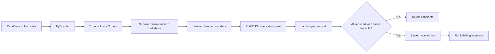

# ADR-003 — Fixed-DH-interface drilling-site optimization (conceptual correction)

- **Status:** Accepted, implemented.
- **Date:** 2026-09-14
- **Decider:** Ishantha Hewaratne
- **Branch:** `feature/fixed-dh-interface-drilling-site-optimization`
- **Informed by:** the R3-CHAIN implementation task "Correct the Optimization
  Problem: Optimize the Geothermal Drilling Site, Not the District-Heating
  Attachment Point"; `docs/specifications/R3CHAIN_CORRECTED_JOINT_SITE_CONNECTION_IMPLEMENTATION_SPEC.md`
  (the v2 joint layer this ADR builds on top of, unmodified).

## Context

`workflow/joint_optimization.py` (v1), `workflow/joint_workflow_v2.py` (v2),
and `workflow/research_experiment.py` (built on top of v2) all evaluate a
candidate as a tuple that includes the district-heating **network attachment
point** — which consumer/trunk junction the geothermal source connects to —
as a free variable, jointly with the geothermal site/scenario. Concretely,
v2's own `AlternativeIdentity` is `(resource_scenario_id, surface_site_id,
attachment_id, route_id, design_option_id, operating_policy_id)`, and
`workflow/joint_enumeration.py::enumerate_compatible_alternatives()` pairs
every site's own scenarios against every route generated to every
`routing_policy.allowed_attachment_ids` entry for that site — routing every
site to every configured attachment (4 attachments × up to 4 sites in the
committed `config/joint_study_synthetic_v2.json`).

That answers: *"which network attachment should geothermal connect to?"* —
not the intended research question. This is a real, previously undetected
gap in the existing implementation, not a hypothetical concern: the
committed v2 fixture genuinely does enumerate, and the CLI genuinely does
rank, alternatives that differ only in which trunk they attach to for a
FIXED site/scenario — a legitimate question, but not the one this correction
is about.

## Decision

The corrected research question: **given one predefined, fixed
district-heating integration point, which geothermal drilling site should be
selected?**

- **Variable:** the geothermal drilling site (and its resource scenario).
- **Fixed system boundary:** the district-heating integration station/heat-
  exchanger station — one declared `NetworkAttachment`, never several.

Candidate identity collapses from the existing six-field
`i=(s,g,a,r,d,o)` to `i=(s,g)` with `a=a0` (the one fixed attachment) — the
production/injection wells meet at one surface plant; the surface heat
exchanger connects the DH supply/return sides locally, not across multiple
competing network destinations.

### Reuse, not reinvention

Every existing physics/economics/decision function required by this
correction is reused **completely unchanged**:

- `network.site_routing.generate_site_routes()` — a route is already
  generated only for `routing_policy.allowed_attachment_ids`; pinning that
  list to exactly one id mechanically fixes the network entry for every
  site, with no code change.
- `workflow.joint_enumeration.enumerate_compatible_alternatives()` — already
  pairs a scenario only with routes belonging to its own site; given routes
  that all target the one fixed attachment, it naturally produces only
  `(site, scenario)`-varying alternatives.
- `workflow.joint_evaluation.evaluate_alternative()`,
  `economics.joint_costing.compute_alternative_economics()`,
  `decision.joint_policy.decide()`/`pareto_shortlist()` — attachment-agnostic
  already; no change needed.

What was missing, and what this correction adds, is the piece that makes
"the network entry does not vary in this methodology" an **explicit,
validated, and tested invariant** rather than an incidental configuration
choice a study-package author could silently violate:

- `data_contracts.fixed_interface.FixedHeatIntegrationStation` — an explicit
  domain model for the one fixed DH/geothermal interface (station id/name,
  network-entry supply/return junction ids, position, a heat-exchanger
  config reference, an optional heat-pump config reference — `None` in this
  branch — and an optional declared thermal-power ceiling).
- `data_contracts.fixed_interface.resolve_fixed_integration_station()` —
  validates that a `JointStudyPackage` declares **exactly one**
  `NetworkAttachment`, that `routing_policy.allowed_attachment_ids` names
  exactly that one id, and that it is eligible; returns a typed
  `FixedInterfaceValidationError` otherwise. A package shaped like the
  existing v2 fixture (4 attachments) is correctly **rejected** — it belongs
  to the joint methodology, never silently reinterpreted as "pick the first
  attachment."
- `workflow.fixed_interface_enumeration.enumerate_drilling_site_alternatives()`
  — a thin wrapper around the unchanged `enumerate_compatible_alternatives()`
  that asserts (defensively) every returned identity shares the resolved
  station's own attachment id.
- `workflow.fixed_interface_workflow.run_fixed_interface_site_optimization()`
  — the new orchestrator: package validation → **station resolution** (the
  one new stage) → PyDoublet parsing → blueprint/baseline → route generation
  → drilling-site-only enumeration → evaluation → decision. Its own result
  type carries `fixed_integration_station` and enforces, as a model
  invariant, that every alternative's `attachment_id` equals it.

### Preserved, not replaced

`workflow/joint_optimization.py` (v1), `workflow/joint_workflow_v2.py` (v2),
`workflow/research_experiment.py`, and every one of their configs, tests,
and artifact bundles are **completely untouched**. This correction is added
as a new, clearly-named, additive methodology
(`fixed_interface_site_optimization`, both as a Python module name and as
the config's own top-level key) — never a rename or in-place edit of the
existing joint layer, and never `joint_location_optimization` (a name that
would remain ambiguous about which axis is fixed).

## Consequences

- New files only: `data_contracts/fixed_interface.py`,
  `workflow/fixed_interface_enumeration.py`,
  `workflow/fixed_interface_workflow.py`,
  `config/fixed_interface_site_optimization_synthetic.json`,
  `config/demo_assumptions_fixed_interface_site_optimization.json`, plus
  their tests.
- Minimal additive touches to existing files: one new public function
  (`network.site_routing.resolve_attachment_coordinate()`, wrapping the
  existing private lookup so the new station model can report its own
  position without duplicating the geometry table), one new CLI dispatch
  branch (`workflow/cli.py`), one new MCP dispatch branch + summary type +
  registry rehydration case (`mcp_server/tools.py`, `schemas.py`,
  `registry.py`), and one pre-existing test intentionally updated
  (`tests/mcp_server/test_joint_workflow_v2_mcp.py::test_capabilities_advertise_both_workflow_modes_as_implementation_capabilities`,
  whose exact-membership assertion now includes the new, legitimately
  registered `fixed_interface_site_optimization` workflow mode — not
  weakened, just widened to reflect a real new capability).
- No scientific assumption, gate, formula, or existing numeric result
  changes anywhere in this branch.

## Explicitly deferred (not implemented in this branch)

- **Fündigkeitsrisiko / geological probability of success.** No
  `geological_probability_of_success` field or expected-value calculation
  exists anywhere in this branch. Any future extension must add it as an
  explicit, optional (`float | None = None`) field on the geothermal
  resource scenario, never a fabricated default (e.g. an invented "20%"),
  and must not contaminate the current deterministic ranking (which never
  reads it). This is a genuine future research phase, not a placeholder
  quietly filled in here.
- **Full network operating-envelope optimization.** The prescribed DH
  supply/return temperatures (`coupling_assumptions.dh_supply_temperature_c`/
  `dh_return_temperature_c`) remain fixed configuration inputs, exactly as
  in every other workflow layer. A future extension could let the network
  determine its own minimum feasible thermal-hydraulic operating envelope
  instead — out of scope here; fixing the spatial optimization problem is
  this branch's whole purpose, not every future research extension at once.
- **Heat-pump-assisted or hybrid integration (`m_i`).** `FixedHeatIntegrationStation
  .heat_pump_config_reference` is `None` throughout this branch — no
  heat-pump physics is implemented. A candidate whose direct heat-exchanger
  coupling is infeasible is reported as infeasible with an explicit failure
  code (`HX_SUPPLY_TEMPERATURE_INFEASIBLE`/`HX_COLD_END_APPROACH_INFEASIBLE`),
  never silently "fixed" by an unmodelled heat pump.
- **Real Wuppertal geological or network data.** Every site, scenario, and
  cost figure in `config/fixed_interface_site_optimization_synthetic.json`
  is synthetic demonstration data, explicitly labelled as such
  (`classification: "synthetic"`, `assumption_status: "synthetic_assumption"`,
  and explicit `source_reference` notes on every fabricated depth value).

## Architecture

